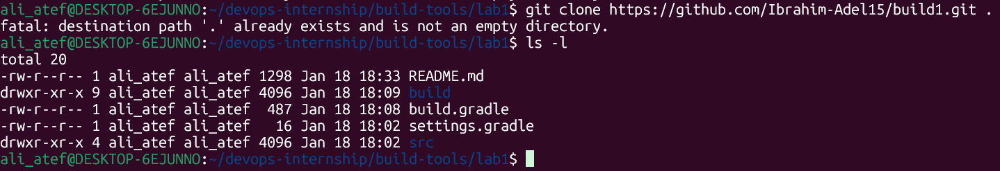
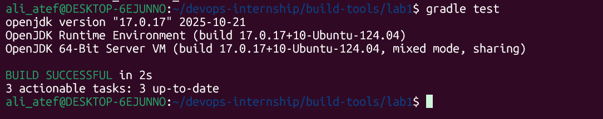
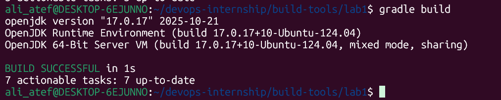

# Lab 1: Java Build Automation with Gradle

## 📝 Lab Description
This lab demonstrates the process of building and packaging a Java application using Gradle on a Linux environment (WSL).

---

## 🚀 Implementation Steps

### 1. Environment Verification
First, I verified the Gradle and Java installation on my WSL environment.
- **Command:** `gradle -v`

### 2. Getting the Source Code
I cloned the application source code to start the build process.
- **Command:** `git clone <repo-url>`

### 3. Execution of Unit Tests
Running tests is a crucial step to ensure code stability before packaging.
- **Command:** `gradle test`

### 4. Building the Artifact
Generating the executable JAR file in the `build/libs` directory.
- **Command:** `gradle build`

### 5. Application Output
Running the generated JAR file to verify the final result.
- **Command:** `java -jar build/libs/ivolve-app.jar`

---
## 🏁 Conclusion
The application was successfully tested, built, and executed. The final output **"Hello iVolve Trainee"** confirms the build process is correct.
