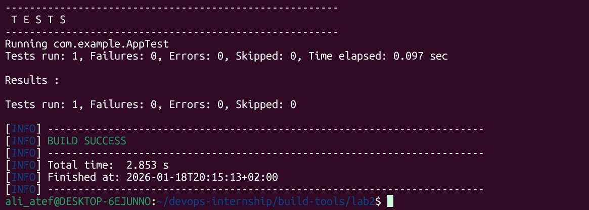
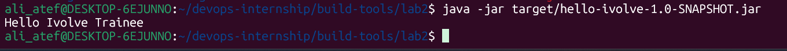

# Lab 2: Java Build Automation with Maven

## 📝 Lab Description
In this lab, I automated the build process for a Java application using **Apache Maven**. The process includes environment setup, testing, packaging, and execution.

---

## 🚀 Implementation Steps

### 1. Maven Installation & Verification
Verified that Maven is installed and configured correctly.
- **Command:** `mvn -v`

### 2. Source Code Acquisition
Cloned the project repository into the lab directory.
- **Command:** `git clone https://github.com/Ibrahim-Adel15/build2.git .`

### 3. Running Unit Tests
Executed the test suite to ensure code quality before building the artifact.
- **Command:** `mvn test`

### 4. Building the Artifact (Packaging)
Generated the JAR file using Maven's package lifecycle. The artifact is created in the `target/` directory.
- **Command:** `mvn package`

### 5. Application Execution & Verification
Ran the final application to verify the output.
- **Command:** `java -jar target/ivolve-app-1.0-SNAPSHOT.jar`

---
## 🏁 Conclusion
The Maven build lifecycle (test, package, and run) was successfully completed. The application is working as expected.
