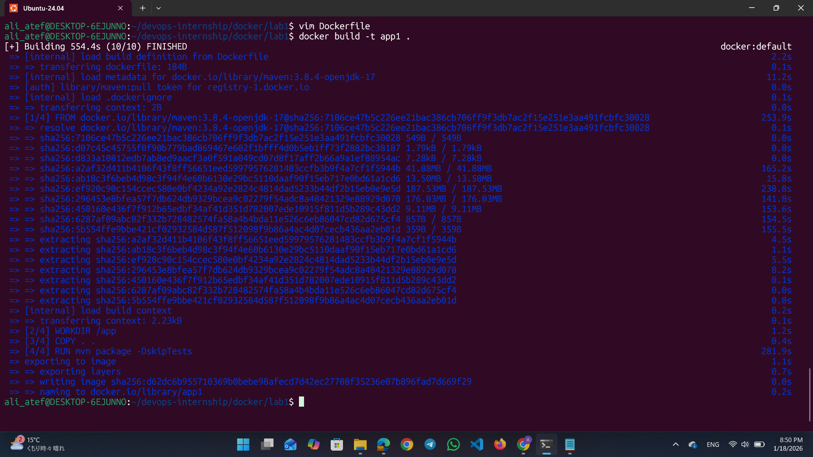
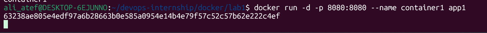
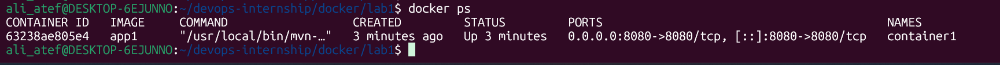
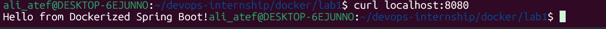
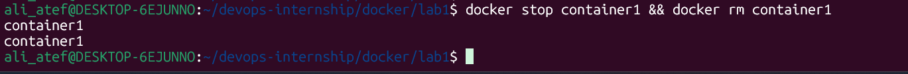

# Lab 1: Java Spring Boot Containerization 🐳

## 📝 Lab Description
This lab demonstrates how to containerize a Java Spring Boot application. I created a Dockerfile to package the application into a Docker image, then ran it as a container and verified its functionality.

---

## 🚀 Implementation Steps

### 1. Dockerfile Creation
I created a Dockerfile using the `maven:3.8.4-openjdk-17` base image to build and run the Spring Boot app.
- **Base Image:** `maven:3.8.4-openjdk-17`
- **Work Directory:** `/app`
- **Exposed Port:** `8080`

### 2. Building the Image
Built the custom Docker image and tagged it as `app1`.
- **Command:** `docker build -t app1 .`

### 3. Running the Container
Started the container named `container1` in detached mode, mapping port 8080.
- **Command:** `docker run -d -p 8080:8080 --name container1 app1`

### 4. Verification & Testing
Checked the running containers and verified the application response.
- **Commands:** - `docker ps`
  - `curl localhost:8080`

### 5. Cleanup
Stopped and removed the container to clean up the environment.
- **Command:** `docker stop container1 && docker rm container1`

---
## 🏁 Conclusion
The Spring Boot application was successfully containerized. The app is accessible on port 8080, confirming the Dockerfile configuration is correct.
