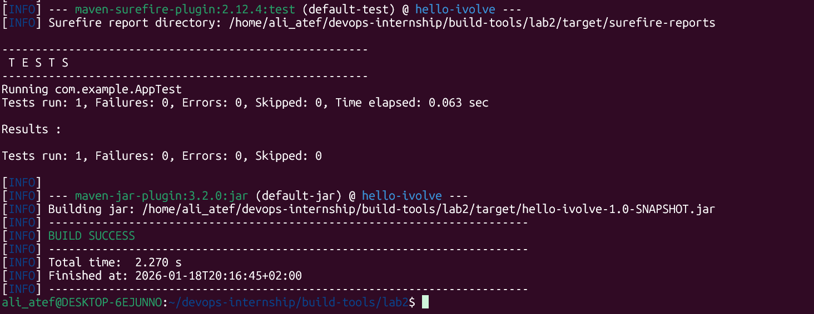
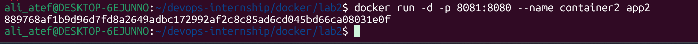
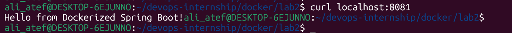
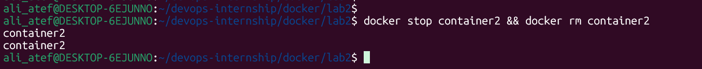

# Lab 2: Optimized Java Containerization 🐳

## 📝 Lab Description
In this lab, I optimized the Docker image size by separating the build process from the runtime environment. Instead of building the application inside the container, I built the JAR file locally and used a **Lightweight JDK Alpine** image to run it.

---

## 🚀 Implementation Steps

### 1. Project Setup & Local Build
I cloned the repository and executed the Maven build command on the host machine to generate the executable JAR file.
- **Repository:** `https://github.com/Ibrahim-Adel15/Docker-1.git`
- **Command:** `mvn package -DskipTests`

### 2. Dockerfile Configuration (Optimized)
I created an optimized `Dockerfile` (available in this directory) using `eclipse-temurin:17-jdk-alpine` as a base image to ensure the smallest possible footprint for the final image.

### 3. Building & Size Comparison
I built the image as `app2` and compared its size with `app1`. The use of an Alpine-based image significantly reduced the image size.
- **Build Command:** `docker build -t app2 .`
- **Size Check:** `docker images | grep app`

### 4. Running the Container
I started `container2` on port 8081 to verify the application is working correctly with the new optimized image.
- **Command:** `docker run -d -p 8081:8080 --name container2 app2`

### 5. Verification & Cleanup
Verified the application response and then removed the container to clean up the environment.
- **Verify:** `curl localhost:8081`
- **Cleanup:** `docker stop container2 && docker rm container2`

---

## 🏁 Conclusion
The optimization was successful. Using a slim runtime image and pre-building the JAR file resulted in a much more efficient deployment compared to the standard build method used in Lab 1i.
