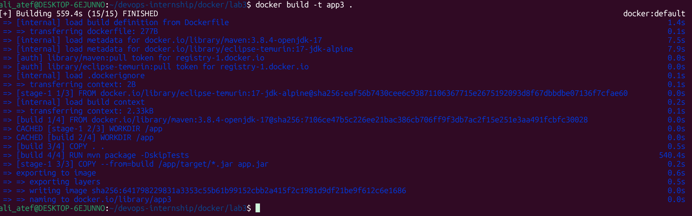
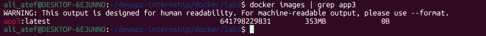
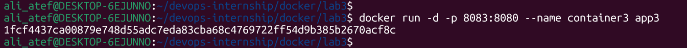
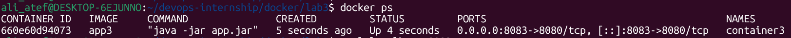
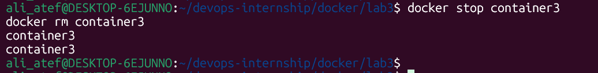

#Lab 3: Multi-Stage Build Optimization 🐳

## 📝 Lab Description
In this lab, I implemented the **Multi-Stage Build** technique. This is the most professional way to build Docker images. It allows us to compile the code (Build Stage) and run the application (Runtime Stage) within a single Dockerfile, ensuring that the final image contains **only** the necessary files to run the app, without any build tools or source code.

---

## 🚀 Implementation Steps

### 1. Building & Optimization (The Build Stage)
I built the image as `app3`. During this process, Docker automatically handled the Maven compilation inside the first stage.
- **Command:** `docker build -t app3 .`

### 2. Size Comparison (The Result)
By using Multi-Stage build, the final image size is significantly smaller because all Maven dependencies and source files were discarded after the build stage.
- **Command:** `docker images | grep app3`

### 3. Running the Container (container3)
I started the optimized container on port 8083.
- **Command:** `docker run -d -p 8083:8080 --name container3 app3`

### 4. Verification & Cleanup
Verified the application response via `curl` and then performed a cleanup.
- **Verify:** `curl localhost:8083`
- **Cleanup:** `docker stop container3 && docker rm container3`

---
