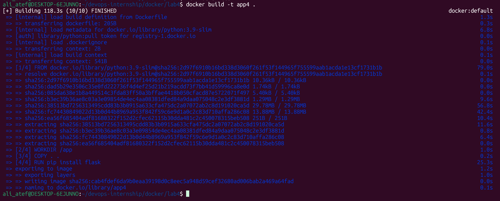
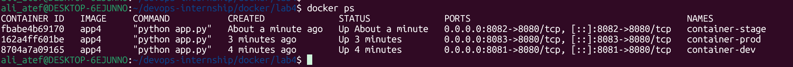
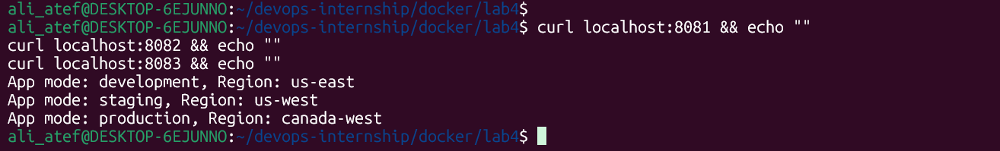

# Lab 4: Managing Docker Environment Variables 🐳

## 📝 Lab Description
This lab focuses on managing application configurations dynamically using **Environment Variables**. I practiced three different methods to inject variables into a Python Flask application, demonstrating how to control app behavior (Development, Staging, Production) without modifying the source code.

---

## 🚀 Implementation Steps

### 1. Project Setup
I cloned the Python Flask application and prepared the environment variables files.
- **Repository:** `https://github.com/Ibrahim-Adel15/Docker-3.git`

### 2. Dockerfile Configuration (Production Defaults)
In the `Dockerfile`, I defined default values for the Production environment using the `ENV` instruction.
- **Default Mode:** `production`
- **Default Region:** `canada-west`
*(Dockerfile is available in this directory)*

### 3. Building the Image
I built the image as `app4`, which contains the Flask app and the default production variables.
- **Command:** `docker build -t app4 .`


### 4. Running 3 Containers (Different Methods)
I deployed the same image in three different environments using three different injection methods:

#### **I. Development (Inline Flags)**
Passing variables directly in the command line using `-e`.
- **Command:** `docker run -d -p 8081:8080 -e APP_MODE=development -e APP_REGION=us-east --name container-dev app4`

#### **II. Staging (Environment File)**
Using a separate `.env` file to pass configurations.
- **Command:** `docker run -d -p 8082:8080 --env-file stage.env --name container-stage app4`

#### **III. Production (Dockerfile Defaults)**
Relying on the values pre-defined inside the Dockerfile.
- **Command:** `docker run -d -p 8083:8080 --name container-prod app4`

### 5. Verification & Container Status
Checking the status of the three running containers and verifying their specific environment outputs.
- **Status Check:** `docker ps`


- **Verification Check:**
  - `curl localhost:8081` (Development)
  - `curl localhost:8082` (Staging)
  - `curl localhost:8083` (Production)


---

## 🧹 Cleanup
To clean up the containers after verification:
```bash
docker stop container-dev container-stage container-prod
docker rm container-dev container-stage container-prod
