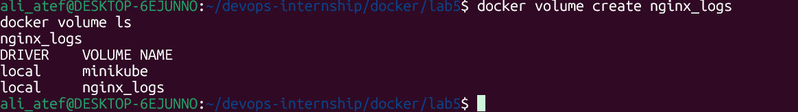

# Lab 5: Docker Volume and Bind Mount with Nginx 🐳

## 📝 Lab Description
In this lab, I implemented **Data Persistence** techniques using Docker. I practiced using **Named Volumes** to persist system logs and **Bind Mounts** to serve custom content from the host machine. This ensures that important data (like logs) is not lost when the container is deleted, and allows for real-time updates to the web content.

---

## 🚀 Implementation Steps

### 1. Creating the Named Volume
I started by creating a dedicated volume called `nginx_logs`. This volume is managed by Docker and is used to store Nginx access and error logs safely on the host system.
- **Command:** `docker volume create nginx_logs`
- **Verify:** `docker volume ls`



### 2. Setting Up the Bind Mount
I created a local directory `nginx-bind/html` and an `index.html` file. This file is "mounted" directly into the container, allowing me to update the website content instantly from my local machine.
- **Path:** `~/devops-internship/docker/lab5/nginx-bind/html`

### 3. Running the Nginx Container
I launched the Nginx container, connecting both the persistent volume and the bind mount to their respective paths inside the container.
- **Command:** 
docker run -d -p 8085:80 \
  --name nginx-container \
  -v nginx_logs:/var/log/nginx \
  -v $(pwd)/nginx-bind/html:/usr/share/nginx/html:ro \
  nginx

### 4. Verification & Live Updates
I verified the initial page via `curl`. Then, I modified the `index.html` file on my host and confirmed that Nginx served the updated content immediately without a container restart.
- **Initial Verify:** `curl localhost:8085`
- **Update Command:** `echo "<h1>Hello Ali, content updated!</h1>" > nginx-bind/html/index.html`
- **After Update:** `curl localhost:8085`


### 5. Log Persistence & Cleanup
I verified that the logs were successfully written to the volume path on the host. Finally, I cleaned up the environment by removing the container and the volume.
- **Log Path:** `sudo ls /var/lib/docker/volumes/nginx_logs/_data`
- **Cleanup:** 
docker stop nginx-container && docker rm nginx-container
docker volume rm nginx_logs
```bash
