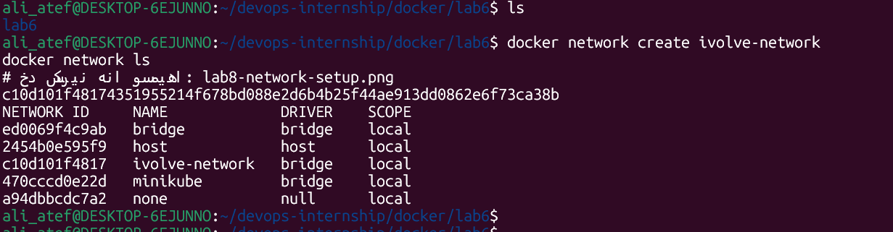
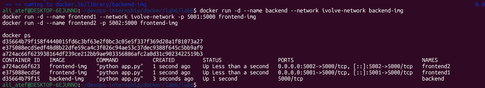
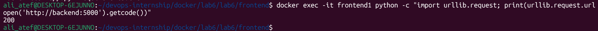
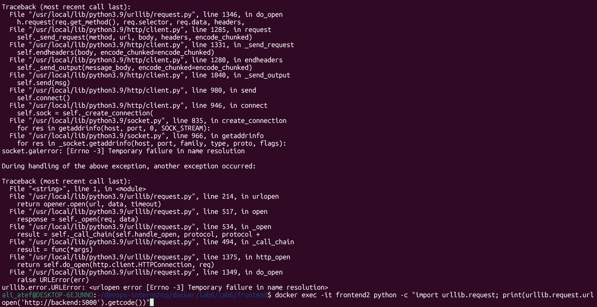

# Lab 6: Custom Docker Network for Microservices 🌐

## 📝 Lab Description
In this lab, I implemented **Docker Networking** to connect microservices. I demonstrated how a custom bridge network allows containers to communicate using their **Container Names** (DNS Resolution) and how containers on different networks remain isolated for security.

---

## 🚀 Implementation Steps

### 1. Cloned the Repository & Prepared Dockerfiles
I cloned the microservices code and created two optimized Dockerfiles using `python:3.9-slim`:
- **Frontend Dockerfile:** Installed packages from `requirements.txt` and exposed port 5000.
- **Backend Dockerfile:** Installed `flask` and exposed port 5000.

### 2. Network and Image Setup
I created a custom bridge network called `ivolve-network` and built the images for both the frontend and backend services.
- **Commands:**
```bash
docker network create ivolve-network
docker build -t frontend-img ./frontend
docker build -t backend-img ./backend
```

### 3. Running the Containers
I deployed three containers with different network configurations:

- **backend:** Connected to ivolve-network.

- **frontend1:** Connected to ivolve-network (to verify successful communication).

- **frontend2:** Connected to the default bridge (to verify network isolation).

- **Command** 
```bash
docker run -d --name backend --network ivolve-network backend-img
docker run -d --name frontend1 --network ivolve-network -p 5001:5000 frontend-img
docker run -d --name frontend2 -p 5002:5000 frontend-img
```

### 4. Communication Verification (The Proof)
I used Python's urllib to test the connectivity between the containers:

- **Frontend1 (Success):** Successfully communicated with the backend and received an HTTP 200 status.

- **Frontend2 (Failure):** Failed to connect with a Temporary failure in name resolution error because it was not on the same network.


### 5. Cleanup & Persistence
Finally, I verified the isolation, then stopped and removed all containers and the custom network to clean up the environment.

- **Command**
```bash
docker stop frontend1 frontend2 backend
docker rm frontend1 frontend2 backend
docker network rm ivolve-network
```
