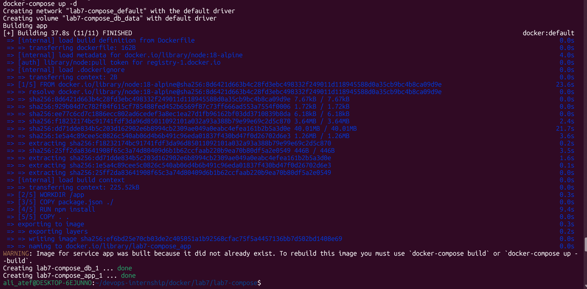
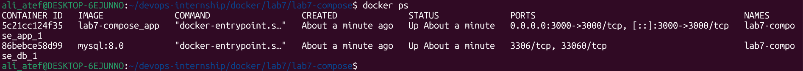
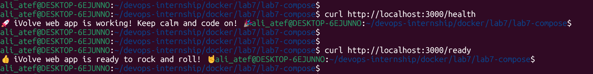
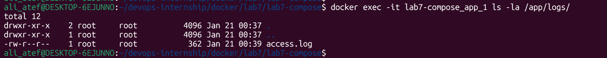
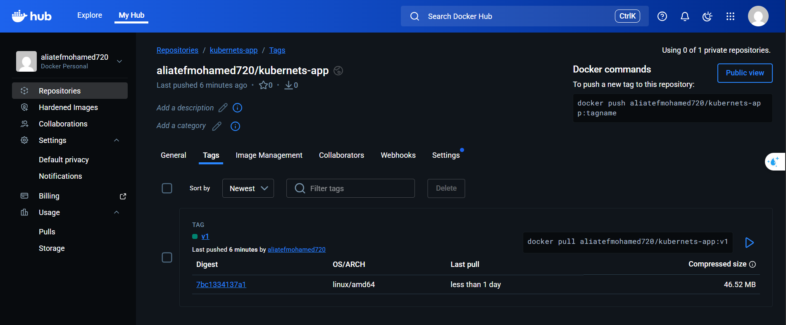

# Lab 7: Containerized Node.js and MySQL Stack Using Docker Compose 🚀

## 📝 Description
In this lab, I deployed a full-stack application consisting of a Node.js web app and a MySQL database using **Docker Compose**. The goal was to ensure connectivity between services, handle persistent data using volumes, and verify application health and logs.

---

## 🛠️ Infrastructure Overview
- **App Service:** Node.js application built from a local Dockerfile.
- **DB Service:** MySQL 8.0 database.
- **Network:** Bridge network automatically created by Docker Compose.
- **Volumes:** `db_data` mapped to `/var/lib/mysql` for data persistence.

---

## 🚀 Step-by-Step Implementation

### 1. Build and Run the Stack
I used a single command to build the images and start the services in detached mode:
```bash
docker-compose up -d
```



### 2. Verify Containers Status
Checking if both the app and database containers are running:
```bash
docker ps
```
## Verification & Testing

### 3. Application Health & Readiness
I verified that the Node.js app is working and successfully communicating with the MySQL database:

- **Health Check:** `http://localhost:3000/health`

- **Readiness Check:** `http://localhost:3000/ready`



### 4. Access Logs Verification
As required by the lab, I verified the presence of access logs inside the container at `/app/logs/`:
```bash
docker exec -it lab7-compose_app_1 ls -la /app/logs/
```


## Docker Hub Deployment
The application image was tagged and pushed to my official Docker Hub account:

- **Repository:** `aliatefmohamed720/kubernets-app:v1`



##Cleanup
To stop and remove all resources:

```bash
docker-compose down -v
```


