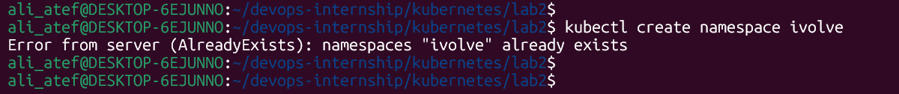
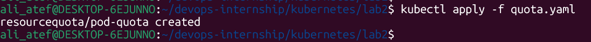
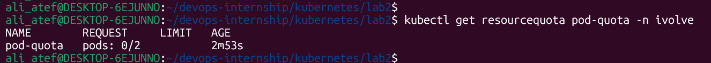
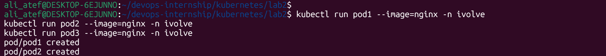

# Lab 2: Namespace Management and Resource Quota

## 🎯 Objectives
- Create a namespace named `ivolve`.

- Enforce a Resource Quota to limit the number of Pods to 2.

## 🛠️ Implementation

### 1. Resource Quota Configuration (`quota.yaml`)
```yaml
apiVersion: v1
kind: ResourceQuota
metadata:
  name: pod-quota
  namespace: ivolve
spec:
  hard:
    pods: "2"
```


### 2. Status and Verification
Checking the quota status after application:
```bash
kubectl get resourcequota pod-quota -n ivolve
```

### 3. Testing the Enforcement
Attempting to run 3 pods resulted in the 3rd pod being blocked as expected.
```bash
kubectl run pod3 --image=nginx -n ivolve
```

